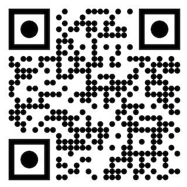

# Guido Asbun Portfolio

## CWID: 874148943

## Email: guido@asbun.io, guido.asbun@csu.fullerton.edu

## Link to deployed application: https://www.guido-asbun.com

## Languages used to build portfolio project:

- JavaScript
- CSS
- JSX
- Node JS

## Frameworks and Libraries Used

- NEXT JS
  - Main framework I used to build the project
  - https://nextjs.org/
- Tailwind CSS
  - Framework used for styling
  - https://tailwindcss.com/
- Material Tailwind
  - Template library used for component structure
  - https://www.material-tailwind.com/
- React-Icons
  - Icon library used for pre made icons
  - https://react-icons.github.io/react-icons/
- Adobe Stock Images
  - Image library used for generic images
  - https://stock.adobe.com/
- ESLint
  - Code analysis tool for identifying problematic patterns in code
  - https://eslint.org/

## Deployment Technologies

- Amazon Web Services Route 53
  - Domain name system service I used to obtain URL http://www.guido-asbun.com
  - https://aws.amazon.com/route53/
- Vercel
  - Cloud platform as a service I used to deploy the site
  - https://vercel.com/

## Tools used

- Figma
  - Web interface design I used to wire-frame
  - https://www.figma.com
- VS Code
  - Ide I used to write the code
  - https://code.visualstudio.com/
